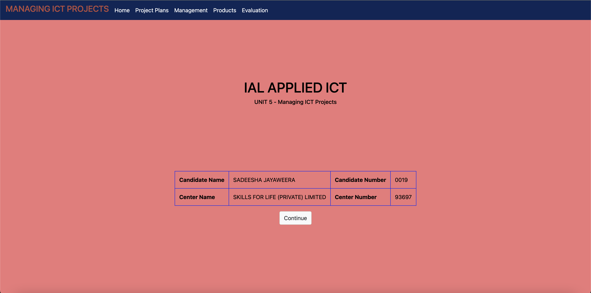

Git Readme for Course Work - Using Multimedia Software
=====================================================

This is a Git readme file for a course work project on using multimedia software. The project was done for the International Advanced Level (UK High School) Applied ICT subject. The project consists of the following sections:

1. Home: Introduction to the project and its objectives.
2. Client Requirements: Details about the requirements provided by the client.
3. Functional Specification: Specifications and objectives of the project.
4. Designing: Information about the design process and tools used.
5. Prototyping: Details about the prototype development and feedback received.
6. Sitemap: Overview of the structure and organization of the multimedia product.
7. Development: Information about the development process and software used.
8. Handover: Preparation of the final product for delivery to the client.
9. Multimedia Product: Description of the final multimedia product.
10. User Feedback: Gathering and incorporating user feedback into the product.
11. Software Used: List of software used during the project.
12. Source List: Sources of information and content used in the multimedia product.
13. Witness Statement: Statement from a witness regarding the project progress.
14. Evaluation: Evaluation of the completed multimedia product.

Development:
-------------
The development phase involved refining the multimedia product based on feedback, comments, and suggestions from the client. Frequent meetings were conducted with the members of the advanced level section and the client to ensure everyone was up to date with the progress. Adobe Flash Professional CC 2015 was used for development due to its user-friendly nature and support for multimedia components.

The information included in the eBook was sourced from various books and websites, such as "www.apepanthiya.com" and "www.nie.lk." Images were obtained from Google and created using Microsoft Office 2016 and Adobe Photoshop CC 2015. Videos were edited using Total Video Converter. The completed multimedia product was tested and user feedback was collected to identify any issues and areas for improvement.

After receiving user feedback, a modified version of the multimedia product was integrated into a DVD disk drive along with a user guide. The DVD disk drive contained the multimedia product in SWF format and the user guide in TXT format, ready for delivery to Mr. Dinesh Bamunusingha.

Client's Requirements:
----------------------
The project was initiated by St Anthony's College Kandy, a school in Sri Lanka, to conduct seminars on General Information Technology (GIT) for G.C.E (A/L) students. The objective was to increase the number of distinction passes in the subject and promote the school. As part of this initiative, a revision guide eBook was planned to be distributed during the seminars. The client requested assistance in preparing the eBook.

The first meeting discussed the special features and requirements for the eBook. The development criteria included making it user-friendly, interactive, and compatible with Flash Player. The eBook was intended for all G.C.E Advanced Level students and would provide multiple-choice questions, short notes, videos, answers, the school logo, and a user guide. The aim was to distribute 400 copies of the multimedia product in DVD disk drives alongside a PDF readme document.

Designing:
-----------
The designs for the multimedia product were created using Adobe Photoshop CC 2015. The designs were exported in JPEG format for presentation purposes. A prototype was presented during the second meeting, and feedback was received to improve the selected design. The font styles, colors, and layout were discussed and refined based on the client's suggestions.

Prototyping:
-------------
The prototype of the multimedia product was developed using Adobe Flash Professional CC 2015. All designs were exported into SWF format for running the prototype on a Flash Player. The prototype was tested, and user feedback was collected to make further modifications.

The third meeting involved presenting the prototype to the client and gathering their feedback. The client expressed satisfaction with the overall design and functionality of the prototype but requested some minor changes in terms of font sizes, colors, and navigation buttons.

Sitemap:
---------
To ensure a well-structured and organized multimedia product, a sitemap was created. The sitemap outlined the main sections and pages of the eBook, including the home page, content pages, interactive quizzes, video pages, and the user guide. This helped in visualizing the flow of the product and ensuring a seamless user experience.

Development:
-------------
Based on the feedback received, the development phase focused on implementing the necessary changes and finalizing the multimedia product. Adobe Flash Professional CC 2015 was utilized for developing the interactive elements, animations, and integrating multimedia components such as videos, images, and audio.

During development, regular testing and quality assurance checks were conducted to ensure that all interactive elements functioned correctly and the multimedia content played smoothly. The navigation within the eBook was made intuitive and user-friendly, allowing users to easily navigate between sections and access the desired content.

User Feedback:
---------------
User feedback played a crucial role in refining the multimedia product. A feedback form was provided to the seminar participants, allowing them to share their thoughts, suggestions, and identify any issues they encountered while using the eBook. The feedback was collected and analyzed to identify common patterns and areas for improvement.

The feedback received from users was incorporated into the final version of the multimedia product. This included fixing any technical glitches, addressing usability concerns, and enhancing the overall user experience. The aim was to create a product that met the needs and expectations of the target audience.

Software Used:
---------------
The following software tools were used throughout the project:

1. Adobe Flash Professional CC 2015: Used for designing and developing the interactive elements, animations, and integrating multimedia components.

2. Adobe Photoshop CC 2015: Utilized for creating and editing visual designs, including images and graphics used in the multimedia product.

3. Microsoft Office 2016: Used for creating additional visual content and graphics.

4. Total Video Converter: Used for video editing and converting video formats as needed.

Source List:
-------------
Various sources were consulted during the project to gather information and content for the multimedia product. These sources include books, websites, and online educational platforms. Some of the sources used are:

- "www.apepanthiya.com"
- "www.nie.lk"
- Google Images

The sources were carefully selected to ensure accurate and reliable information for the content included in the eBook.

Handover:
----------
Once the final version of the multimedia product was completed, it was prepared for handover to the client. The multimedia product was burned onto DVD disk drives along with the user guide in TXT format. The DVD disk drives were labeled appropriately and packaged securely for delivery to Mr. Dinesh Bamunusingha.

Evaluation:
------------
An evaluation of the completed multimedia product was conducted to assess its effectiveness in achieving the project objectives. This involved analyzing user feedback, assessing the functionality and usability of the product, and comparing it against the initial requirements and specifications.

The evaluation process helped identify strengths and weaknesses, providing insights for future improvements or enhancements. The feedback received from users and the client was considered valuable for further iterations or updates to the multimedia product.

Conclusion:
------------
This Git readme provides an overview of the course work project on using multimedia software. It covers the development process, client requirements, design, prototyping, development, user feedback, software used, source list, handover process, and evaluation of the final multimedia product.

The project aimed to create a user-friendly and interactive eBook for G.C.E Advanced Level students, providing them with a revision guide for General Information Technology. By incorporating multimedia elements such as videos, interactive quizzes, and visual content, the multimedia product aimed
.
